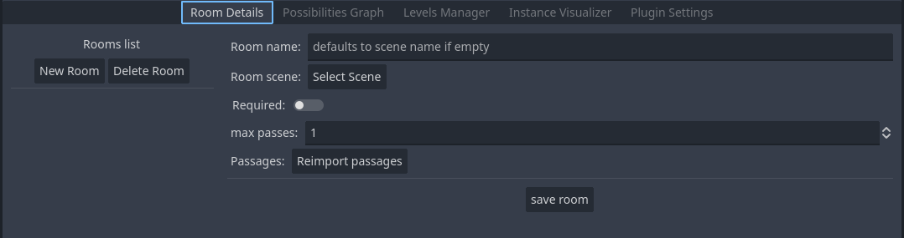
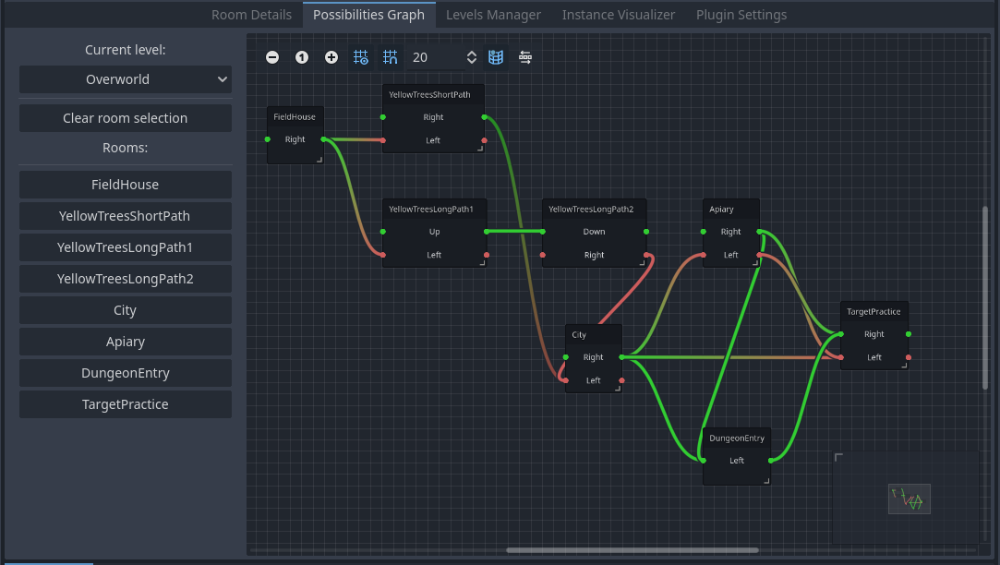
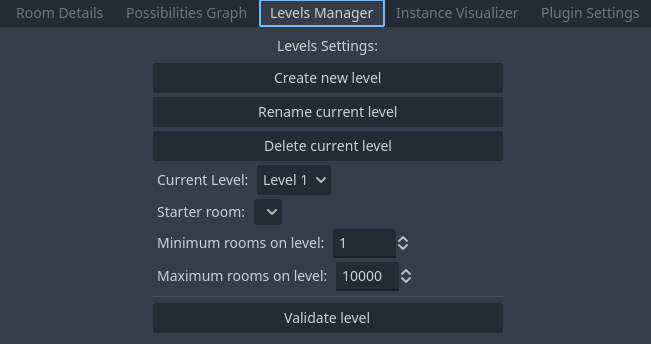

# Roguelike-System
This repository contains a Godot plugin designed to assist in creating procedurally generated levels.

The plugin supports both 2D and 3D games, allowing users to define levels using scenes as rooms. Each room must include passages that connect to other rooms. While passages can initially have multiple potential connections, the system ensures that in the final generated level, each passage is connected to exactly one other passage.  

Godot version: 4.3

## How to Use

1. **Clone the Repository**  
   Clone this repository and add it to your Godot project. The main files are located in the `roguelike_system` folder inside `addons`. Additionally, there are two demo projects included, which can help you understand how to use the plugin.

2. **Enable the Plugin**  
   In Godot, go to `Project > Project Settings > Plugins`, locate "Roguelike System," and enable it.

3. **Access the Roguelike System**  
   Once the plugin is enabled, a new option labeled **Roguelike System** will appear in the top-middle section of the editor.  

4. **Creating Rooms**  
   Click on **Roguelike System** to open the room creation screen. Here, you can register rooms with the following details:
   - **Name**: The name of the room;
   - **Scene**: The scene file representing the room;
   - **Required**: Specify whether the room is required (it must appear in every generated level);
   - **Max Passes**: The maximum number of times this room can be included in the same level;
   - **Passages**: Passages will be automatically detected if your scene includes a node named `Passages` containing the passage nodes inside it.

   

5. **Adding Connections**  
   After registering a room, you can define its connections;  
   - To add connections from a list, use the **Room Details** screen;  
   - Alternatively, click on **Possibilities Graph** for a visual approach.

6. **Possibilities Graph**  
   The Possibilities Graph allows you to visually manage connections between rooms;  
   - Add connections by dragging from a colored dot on one room and attaching it to another;  
   - To focus on a specific room, click on it in the left-side menu. This will hide all other connections, making it easier to work with.  

   

7. **Levels Manager**  
   The Levels Manager provides the ability to create, rename, and delete levels from the current map.  

     

   Key Features:  
   - **Current Level**: Select and modify the active level;  
   - **Starter Room**: Set a starter room, required for level generation;  
   - **Room Limits**: Define the minimum and maximum number of rooms allowed in a level;  
   - **Validate level**: Validate the level to ensure all registered rooms and their associated scenes are correctly configured.  

8. **Generating Levels**  
   After registering rooms and defining connections, you can generate levels using the **Roguelike System Map Exporter**.  

   1. **Download the Exporter**  
      - The exporter can be found in this repository: [Roguelike-System-Map-Exporter](https://github.com/gabrdra/Roguelike-System-Map-Exporter);  
      - Download the executable from the **Releases** section of the repository.  

   2. **Configure the Exporter**  
      - Open the `.ini` configuration file included with the exporter;  
      - Update the paths for the map file and exported map as needed.  

   3. **Run the Exporter**  
      - Execute the downloaded file to generate the level possibilities.  

9. **Instance Visualizer**  
   The **Instance Visualizer** allows you to preview the generated levels from your exported map.  
   - Load the exported map into the Instance Visualizer;  
   - Select the level you want to visualize from the available options;  
   - Click on **Generate** to display the level layout;  
   - Optionally, set a seed to regenerate the same level consistently.  

10. **Plugin Settings**  
    In the **Plugin Settings** screen you can:
    - See the path for the current map;
    - Create a new map;
    - Rename the current map;
    - Load an existing map;
    - Change the name of the default node that holds the passages.
